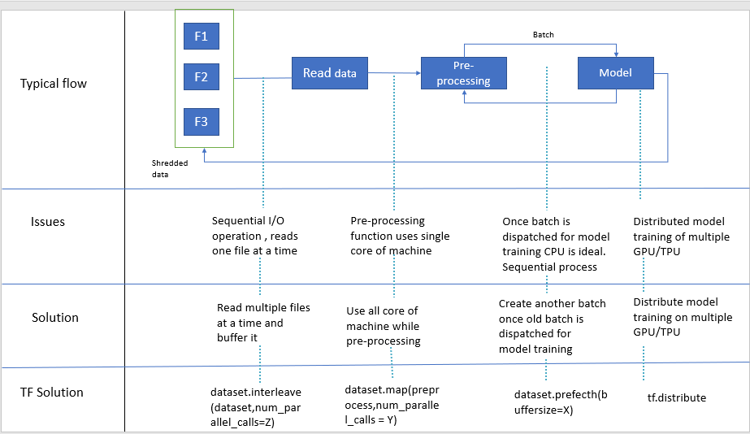

# Wide and Deep Neural model for structure data

In this notebook we will cover how to create Wide and Deep model for strcutured data with tf.keras layers with below tensorflow features. I will also share references like youtube videos & notebooks which has inspired this work.

- Tensorflow Dataset API
- Distributed strategy
- Tensorboard for experiment tracking
- Tensorflow profiling
- visualizing keras Model 
- Feature Engineering
  - One-Hot encode of categorical attributes
  - Feature crossing
  

