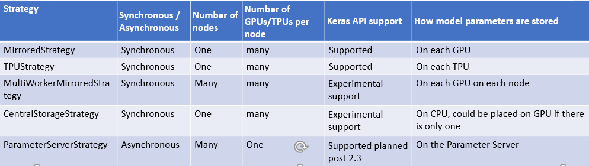
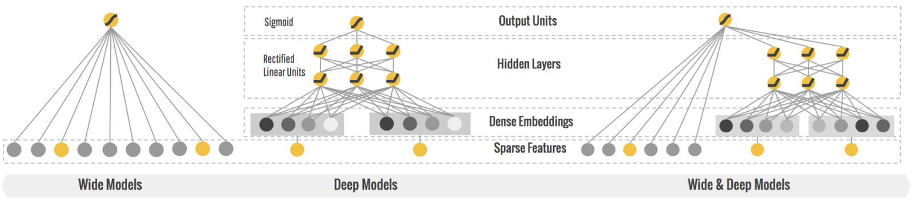

# Wide and Deep model for structure data

In this notebook we will cover how to create Wide and Deep model for strcutured data with tf.keras layers with below tensorflow features. I will also share references like youtube videos & notebooks which has inspired this work.

- Tensorflow Dataset API
- Distributed strategy
- Tensorflow profiling
- Wide and Deep model 
- Feature Engineering
  - One-Hot encode of categorical attributes
  - Feature crossing

# Dataset API
This is primarily to solve data pre-processing bottleneck

- **Parallel Interleave**: to process many input file concurrently
- **Parallel map** : to apply pre-processing function parallelly to dataset
- **Prefecth** : once a batch is dispatched for model training CPU is Idle, Prefecth will start working on next batch as soon as data has been dispatched for model traning
- **snapshot**: persist the output of preprocessing pipeline to disk, so do it once use many many times , this is particularly useful when you are trying to different architecture & hyperparameter.
- **tf.data service** : Scale horizontally your pre-preporcessing, if there is one host CPU which is feeding multiple GPU/TPU. if that feeding service has bottleneck you can offload that to multiple CPU via tf data service with just one line of code (dataset.distribute("<master address>")). it has master worker architecture. this can be used when snapshot is not possible (when pre-processing has some randomization)

**Note: Number of parallel call is also hyperparameter to select correct value automatically use tf.data.experiment.AUTOTUNE parameter**

**Few important resource:**

- [Scaling Tensorflow data processing with tf.data] (https://www.youtube.com/watch?v=n7byMbl2VUQ)
- [Inside TensorFlow: tf.data + tf.distribute] (https://www.youtube.com/watch?v=ZnukSLKEw34&t=886s)

# Distributed strategy

In this we will distribute different batch of data to train replica of model on different devices & after every pass synchronization will happen. Except ParameterServerStrategy all other strategy is synchronus. 
- **Synchronous training** :  Replica of the model architecture is created on each devices. In forward pass different batch of training data will be used  & backward pass individual gradients will be calculated. Now variable which are replicated have different state as data is different.At this point sync will take place using all reduce algo.
-- **Ring-allreduce architecture** : Network efficient way to aggregate gradients. Sync will be performed from every device to every other device in circular fashion. Reduce operation can be sum or mean on the basis of algo
- **code**: for default strategy you dont need to wrap keras model code in strategy scope.
strategy = tf.distribute.MirroredStrategy() # define strategy
with strategy.scope():
  "Keras model code"
- **Multi worker mirrored all reduce strategy** uses TensorFlow collective ops which helps to broadcast all variable to synchronizing gradients at each step. It works very similar way of mirrored strategy but uses multiple workers (Nodes) to distributes work on GPU of multiple machines
- **TPU Strategy**: all reduce sync training on TPU is very similar to mirrored strategy only thing is it utilizes TPU instead of CPU. For reduce method it uses cross replica sum 
- **Parameter server strategy** is asynchronous strategy. In this one worker will act as parameter server and other workers will train model and send updates to parameter server, each workers run independently
- **Central storage** : this is special case of parameter server strategy where all parameters are hold by CPU but it performs synchronous strategy. So variables are not mirrored instead they are placed on CPU and replica across all GPU.

[Distributed TensorFlow] (https://www.oreilly.com/content/distributed-tensorflow/#:~:text=In%20synchronous%20training%2C%20the%20parameter,loop%20repeats%20until%20training%20terminates).

# Tensorflow Profiler
**Note: Host means CPU & device means GPU/TPU (for model training)** 

If your ML model training is slow than slowness can be due to CPU where pre-processing,data loading and data transfer from host to device happens OR at GPU where model training is happening. Tensorflow profiler is used to identify that bottleneck & gives recommendation to solve that.We cant cover everything here since its topic by itself. we will try to cover functionality  at very high level.

- **Overview** :
  - it shares aggregated performance summary across all the devices & host. 
  - also gives recommendation if model is input bound i.e. CPU is taking too much time to share information with GPU. 
- **Input pipeline analyzer** :
  - it gives much more details of pipeline segregating device side analysis & host side analysis 
- **tf.data bottleneck analysis** :
  - it automatically detects bottleneck in tf.data input pipeline & provides recommendation to fix it (experimental mode)
- **Pod viewer** :
  - it breakdowns the training steps across all workers. you can select specific traning step from top
- there are few more tabs like TensorFlow stats,Trace viewer,GPU kernel stats,Memory profile tool (used for OOM error).please refer official guide for more detail(https://www.tensorflow.org/guide/profiler#overview_page)

# Wide and Deep model:

- Deep model works best when input are dense & correlated (continous variable), where as linear model works best with sparse & independent input (categorical variable)
- deep model generalize well & wide model memorize well
- In real world data we need both characteristic in model i.e. memorization and generalization.
- continous varilable is passed to multiple dense layer where as categorical variable is directly connected to output.

