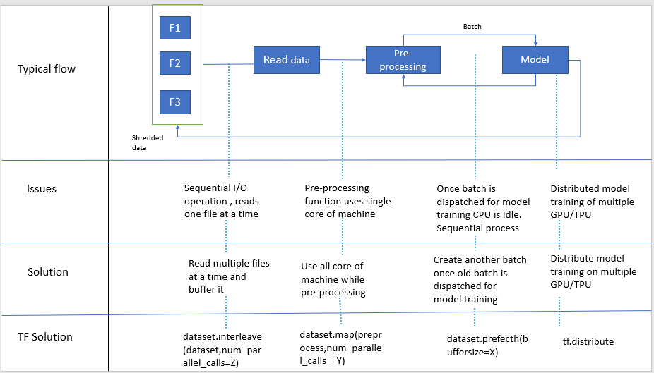

# Wide and Deep Neural model for structure data

In this notebook we will cover how to create Wide and Deep model for strcutured data with tf.keras layers with below tensorflow features. I will also share references like youtube videos & notebooks which has inspired this work.

- Tensorflow Dataset API
- Distributed strategy
- Tensorboard for experiment tracking
- Tensorflow profiling
- visualizing keras Model 
- Feature Engineering
  - One-Hot encode of categorical attributes
  - Feature crossing

# Dataset API
This is primarily to solve data pre-processing bottleneck

- **Parallel Interleave**: to process many input file concurrently
- **Parallel map** : to apply pre-processing function parallelly to dataset
- **Prefecth** : once a batch is dispatched for model training CPU is Idle, Prefecth will start working on next batch as soon as data has been dispatched for model traning
- **snapshot**: persist the output of preprocessing pipeline to disk, so do it once use many many times , this is particularly useful when you are trying to different architecture & hyperparameter.
- **tf.data service** : Scale horizontally your pre-preporcessing, if there is one host CPU which is feeding multiple GPU/TPU. if that feeding service has bottleneck you can offload that to multiple CPU via tf data service with just one line of code (dataset.distribute("<master address>")). it has master worker architecture. this can be used when snapshot is not possible (when pre-processing has some randomization)

**Note: Number of parallel call is also hyperparameter to select correct value automatically use tf.data.experiment.AUTOTUNE parameter**

**Few important resource:**

- [Scaling Tensorflow data processing with tf.data] (https://www.youtube.com/watch?v=n7byMbl2VUQ)
- [Inside TensorFlow: tf.data + tf.distribute] (https://www.youtube.com/watch?v=ZnukSLKEw34&t=886s)

