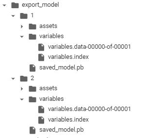

# Tensorflow Serving 

- Deployment of tensorflow model can be done in two way. Flask or Tensorflow serving 
- traditional way of deploying model is using flask but its really inefficent way of doing it.
  - no consistent API & payload
  - No model versioning 
  - No mini batch support 
  - Inefficent for large model
- Tensorflow server is production ready model serving solution 
  - works well for large model upto 2 GB (probuf has limit)
  - part of TFX 
  - highly scalable for model serving solution

## Model export

- export using tf.saved_model.save function, it will export it as pre-defined structure for each version you mention.
  - model as protobuf (saved_model.pb)
  - asset contains additional files like vocabulary 
  - variables and checkpoints

  
## Serve with Docker
- docker images are available for CPU & GPU.
- pull docker image -> run docker image with "docker run" command with certain parameters
    - docker run -p 8501:8501 
            --mount type=bind,
             source=/path/to/my_model/
             target=/models/my_model 
            -e MODEL_NAME=my_model 
            -t tensorflow/serving 
- to run it for GPU , just change container name
- it will create two end point one with gRPC and one for REST
- you can deploy it on GCP,AWS & other cloud service , it will need authentication key.

## Model server configration for multiple model 
- you can deploy multiple models with different version. Bydefault tensorflow will take latest version of deployed model 
- there is configration called polling frequency for newer version (model_config_file_poll_wait_seconds )
- for advance use cases like monitoring configration, batching configration,Assigning String Labels to Model Versions to Simplify Canary and Rollback,Serving a Specific Version of a Model you need to create config files.
- **Model Config file**:
  - to server multiple model version. 
  - can also load specific model version 
  - version labels can also be defined ex: testing or stable
- **Meta information**: its very useful for model telementry tracking , endpoints provides model signature i.e. input & output
- **batching configration**: server can aggregate inference request & compute them as block, efficent way of utilizing hardware, it wont be real time , it will be near real time

## REST vs gRPC
https://cloud.google.com/blog/products/api-management/understanding-grpc-openapi-and-rest-and-when-to-use-them
